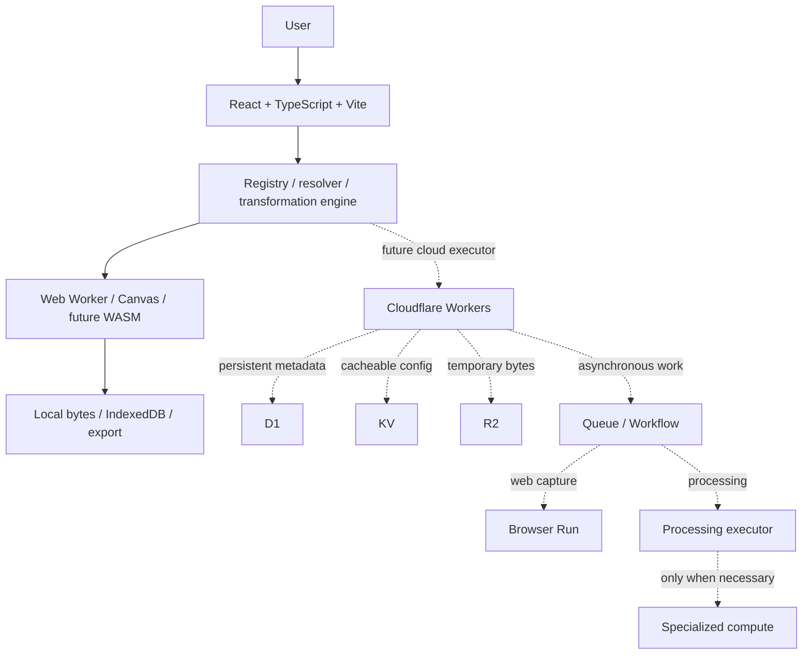

# Architecture

## Browser first → Cloudflare second → external compute only when required

One app with modular core, storage, executors, state, pages, and UI. Avoid a monorepo until independent deployments justify it. React/Vite is sufficient for the interactive product; Workers Static Assets with Cloudflare's official Vite plugin supplies SPA hosting and a future API runtime. No server rendering dependency is needed now.

Zustand controls the active session. IndexedDB stores a graph snapshot and bytes atomically. Persistence operations are serialized to prevent stale writes and clear/save races. Rendering uses a dedicated worker with OffscreenCanvas where supported and a main-thread Canvas fallback. Workers are terminated after each operation or timeout. Preview URLs are revoked on unmount/change; export URLs shortly after download.

Current deployment uses no cloud storage, authentication, or database bindings. Wrangler configuration includes distinct staging and production targets and observability. The empty Worker handles non-asset unknown requests. Future bindings must be typed using generated Wrangler types, documented per environment, and introduced only alongside implemented consumers.

Remove BG declares the `local-background` execution requirement and uses the common engine with an optional progress callback. Its worker lazy-loads ONNX Runtime's WASM-only bundle and the same-origin `public/models/u2netp.onnx` asset. A single WASM thread avoids requiring cross-origin isolation headers. Source-pixel RGB/alpha are preserved while a 320px segmentation mask is resized and composited at the original dimensions. The runtime and model remain below Cloudflare's per-asset limit; no external compute/storage service or binding is needed.

Future: R2 for temporary binary objects with explicit ownership/expiry; D1 only for persisted relational app/job data; KV only for non-critical cached configuration; Queues for asynchronous jobs; Workflows for durable execution sequences; Browser Run for URL capture. Durable Objects only for coordination that requires strong state. User graphs remain independent of infrastructure Workflows. Cloudflare Images is optional, never necessary for local operations.

Future cloud jobs need idempotency because Queues can deliver messages more than once, retry limits, failure states, cancellation checks, and cleanup. Use scheduled cleanup plus R2 lifecycle policies; access must reject expired objects even before physical deletion. External compute is a replaceable executor for documented native/CPU/RAM constraints, never the default.

## SS-01 editor decision

Evaluated [Konva](https://konvajs.org/docs/index.html) and [Fabric](https://fabricjs.com/docs/): both offer mature object interaction and transforms; Konva has official React bindings and Fabric has editable text/controls. Both are MIT licensed. They would add a canvas object model/runtime and still require an accessible DOM properties/selection layer and draft graph boundary. Exact package bundle sizes were not benchmarked or claimed; no editor dependency was installed. For four bounded primitives and at most 100 elements, a small Canvas overlay plus DOM move/resize buttons is the simplest fit. Revisit the choice for future freeform/composition requirements.

`AnnotationEditor` is React-lazy loaded on first Annotate use. Draft snapshots are keyed by source ID inside the mounted editor and capped to 50 undo steps. Pointer capture groups each gesture into one undo step; cancellation restores its starting state. ResizeObserver and image-load listeners synchronize source/display scale and are removed on cleanup. Draft warning is portaled into the preview, so switching tools preserves the workspace grid.

The preview transparent layer and PNG export use `drawAnnotations` with identical source pixels, clipping, text wrapping and system font. Export is deliberately main-thread Canvas to use the same browser font environment; no worker or image network request is introduced. Bitmaps close in finally blocks. The small renderer is dynamically imported by the local executor; existing image/background workers remain unchanged. Metadata/bytes stay separate. Structured operation parameters are deep-cloned at commit.
