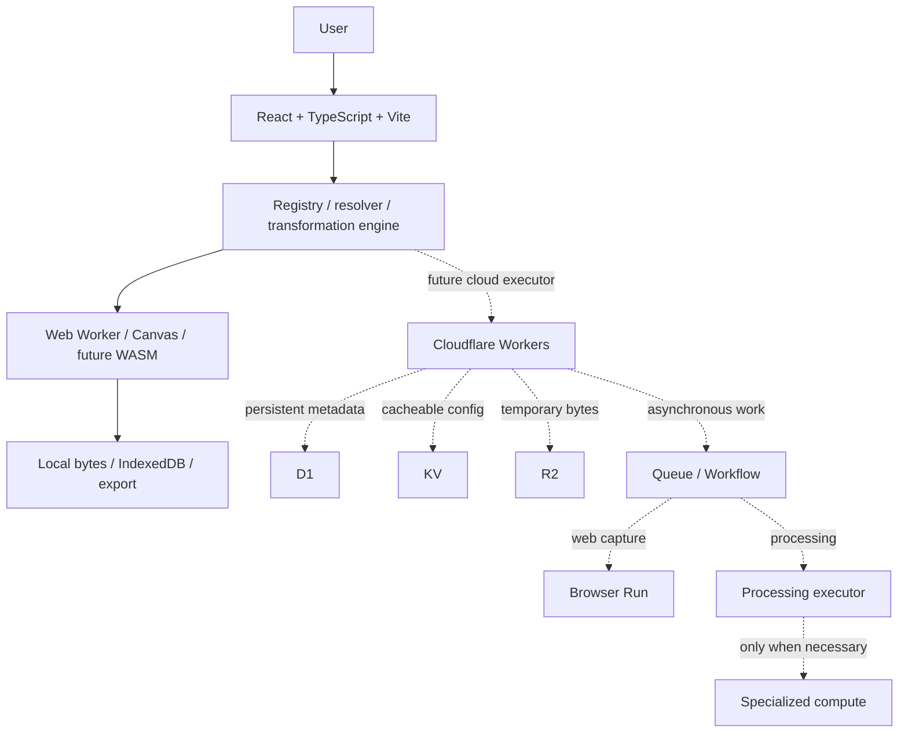

# Architecture

## Browser first → Cloudflare second → external compute only when required

One app with modular core, storage, executors, state, pages, and UI. Avoid a monorepo until independent deployments justify it. React/Vite is sufficient for the interactive product; Workers Static Assets with Cloudflare's official Vite plugin supplies SPA hosting and a future API runtime. No server rendering dependency is needed now.

Zustand controls the active session. IndexedDB stores a graph snapshot and bytes atomically. Persistence operations are serialized to prevent stale writes and clear/save races. Rendering uses a dedicated worker with OffscreenCanvas where supported and a main-thread Canvas fallback. Workers are terminated after each operation or timeout. Preview URLs are revoked on unmount/change; export URLs shortly after download.

Current deployment uses no cloud storage, authentication, or database bindings. Wrangler configuration includes distinct staging and production targets and observability. The empty Worker handles non-asset unknown requests. Future bindings must be typed using generated Wrangler types, documented per environment, and introduced only alongside implemented consumers.

Remove BG declares the `local-background` execution requirement and uses the common engine with an optional progress callback. Its worker lazy-loads ONNX Runtime's WASM-only bundle and the same-origin `public/models/u2netp.onnx` asset. A single WASM thread avoids requiring cross-origin isolation headers. Source-pixel RGB/alpha are preserved while a 320px segmentation mask is resized and composited at the original dimensions. The runtime and model remain below Cloudflare's per-asset limit; no external compute/storage service or binding is needed.

Future: R2 for temporary binary objects with explicit ownership/expiry; D1 only for persisted relational app/job data; KV only for non-critical cached configuration; Queues for asynchronous jobs; Workflows for durable execution sequences; Browser Run for URL capture. Durable Objects only for coordination that requires strong state. User graphs remain independent of infrastructure Workflows. Cloudflare Images is optional, never necessary for local operations.

Future cloud jobs need idempotency because Queues can deliver messages more than once, retry limits, failure states, cancellation checks, and cleanup. Use scheduled cleanup plus R2 lifecycle policies; access must reject expired objects even before physical deletion. External compute is a replaceable executor for documented native/CPU/RAM constraints, never the default.

## SS-01 editor decision

Evaluated [Konva](https://konvajs.org/docs/index.html) and [Fabric](https://fabricjs.com/docs/): both offer mature object interaction and transforms; Konva has official React bindings and Fabric has editable text/controls. Both are MIT licensed. They would add a canvas object model/runtime and still require an accessible DOM properties/selection layer and draft graph boundary. Exact package bundle sizes were not benchmarked or claimed; no editor dependency was installed. For four bounded primitives and at most 100 elements, a small Canvas overlay plus DOM move/resize buttons is the simplest fit. Revisit the choice for future freeform/composition requirements.

`AnnotationEditor` is React-lazy loaded on first Annotate use. Draft snapshots are keyed by source ID inside the mounted editor and capped to 50 undo steps. Pointer capture groups each gesture into one undo step; cancellation restores its starting state. ResizeObserver and image-load listeners synchronize source/display scale and are removed on cleanup. Draft warning is portaled into the preview, so switching tools preserves the workspace grid.

The preview transparent layer and PNG export use `drawAnnotations` with identical source pixels, clipping, text wrapping and system font. Export is deliberately main-thread Canvas to use the same browser font environment; no worker or image network request is introduced. Bitmaps close in finally blocks. The small renderer is dynamically imported by the local executor; existing image/background workers remain unchanged. Metadata/bytes stay separate. Structured operation parameters are deep-cloned at commit.

## SS-02 processing and schema decision

Extend the existing annotation workflow rather than creating a separate upload/editor/export app. Operation and document version 2 introduce blur and redact elements; version 1 documents remain valid with their original four kinds. Recovery validates historical record version 1 with document version 1 and record version 2 with document version 1 or 2, reports malformed provenance, and never automatically replays recovered operations. IndexedDB version and historical primitive operation shapes remain unchanged.

Blur uses a deterministic separable box filter with premultiplied RGB and clamped region edges, avoiding browser-specific Canvas filter support and hidden transparent RGB bleed. Radius is 1–64 source pixels; all blur regions together are capped at 4 megapixels per operation to bound temporary memory. Rendering remains local on the main thread for agreement with existing text/Canvas output. Revisit worker preview/caching for larger compositions rather than silently increasing this budget.

Redaction rounds selection edges outward to full pixels, clears and fills the entire region with opaque RGB/alpha. It is pixel overwrite in the output PNG; it does not delete the original graph node or original stored bytes. Region operations are applied in document order. Subsequent elements can add new pixels but cannot recover overwritten pixels. Blur is cosmetic. Neither feature promises PDF content redaction or original/session deletion.

Preview now renders a complete source composite through the same renderer, temporarily hiding the underlying displayed image to avoid double-compositing semi-transparent pixels. Async decoding is cancelled on source/editor changes; cleanup restores source visibility. Invalid drafts show the source and an explicit preview error; engine validation rejects Apply before execution.

## Cloudflare boundary matrix

| Service             | Boundary / intended responsibility                                             | Current state                          | Prerequisite                                                                 |
| ------------------- | ------------------------------------------------------------------------------ | -------------------------------------- | ---------------------------------------------------------------------------- |
| Workers             | Static assets now; future validated API/orchestration behind executor contract | Local/staging/production configuration | Authentication and secure job slice before API consumers                     |
| R2                  | `StorageReference.kind = r2`, replaceable byte resolver                        | Type only; resolver rejects cloud refs | Owned, expiring objects, access validation, lifecycle cleanup                |
| D1                  | Persist necessary relational project/job metadata, separate from bytes         | Deferred                               | Concrete persistence need and migration design                               |
| KV                  | Cache/config whose consistency tolerates KV semantics                          | Deferred                               | Concrete cache/config requirement                                            |
| Queues              | Job transport behind cloud-job executor; idempotent consumers                  | Deferred                               | Job IDs, retry/cancel/failure contract and R2                                |
| Workflows           | Durable remote execution sequence, separate from user graph                    | Deferred                               | Demonstrated long-running workflow                                           |
| Durable Objects     | Strongly coordinated mutable state                                             | Deferred                               | Coordination requirement that simpler storage cannot meet                    |
| Browser Run         | `browser-capture` executor for Web Capture                                     | Interface only                         | SSRF/subresource/redirect controls and resource budgets                      |
| External processors | `external` executor and remote storage references                              | Interface only                         | Measured browser/Cloudflare incompatibility; privacy and lifecycle contracts |

These interfaces do not imply resources were deployed. No credentials are configured in this cloud environment. Local processing needs none. Do not invent public endpoints or bind unused infrastructure.

## Foundation hardening — 7 October 2026

Input detection checks PNG/JPEG/WebP magic bytes before browser decoding, so a missing or incorrect browser MIME hint/extension cannot misclassify a real image. Decoding still verifies actual readability and dimensions; the byte Blob is normalized to detected MIME without rewriting original contents. Size limits run before reading headers.

The engine takes a validated parameter snapshot before async execution and passes an independent copy to the executor. Caller/executor mutations cannot corrupt the recorded provenance. `TransformError` provides stable codes for compatibility, validation, unavailable executors, execution failure and invalid output, with user-facing messages and original causes. Output identity must differ from the source; the graph commits only after successful processing.

ESLint now covers JavaScript/TypeScript errors and React hook ordering. TypeScript remains the strict type check; Prettier owns formatting. Playwright optionally selects an installed Chromium via an explicit executable-path variable when managed browser downloads are restricted.

## SS-03 execution contract

Transformation definitions now declare minimum/maximum input and output counts. Defaults and validation receive ordered object arrays; capability resolution checks all MIME types, input counts and unique identities. Executors consume ordered arrays and return arrays. Existing image operations explicitly remain one-input/one-output. The engine accepts a single-object shorthand for callers but normalizes to the same array contract.

One-to-many, many-to-one and many-to-many execution are supported in the shared contract. All output identities/counts/MIME types are checked before any graph commit. appendResult validates existing sources, unique fresh outputs, exact ordered relationships and operation identity before committing the whole result. IndexedDB persists every output in the existing atomic transaction. Single-object workflows and old operation records retain their stored shapes. Product selection and concrete compositions are delivered below; PDF operations are not yet implemented.

## SS-03 composition renderer and workspace boundary

`core/composition.ts` is the shared geometry/validation contract. `executors/composition.ts` is lazily imported by the local executor for Frame/Combine. It validates dimensions and total source/output pixel budgets before canvas allocation, decodes inputs sequentially with orientation applied, checks decoded dimensions against metadata, closes every bitmap in finally, verifies PNG encoding and releases the canvas backing store on success/failure. Main-thread Canvas is sufficient for this bounded slice; no editor library, model, template asset or cloud dependency was added. Large previews can occupy the main thread; worker/caching optimization remains a later measured need.

The workspace passes explicitly ordered source IDs to state.apply, which resolves existing objects then invokes the common engine. It returns success for the draft/apply boundary; a failed operation retains inputs/active selection/history. History labels reference all parents. The debounced preview invokes the same engine/executor with an AbortSignal, discards the temporary result without graph/storage commits and revokes URLs on change/unmount. It uses full output pixels rather than an approximate separate rendering path. Copy/download stay unavailable while editing a composition draft to avoid exporting the wrong image. Existing worker rendering and the annotation editor are retained.

The generic executor already supports one-to-many/many-to-many outputs, with atomic graph and IndexedDB transactions covered by tests. DC-01 must add genuine PDF detection/import/preview/operations through these contracts; no schema migration or cloud executor is required just to support cardinality.
